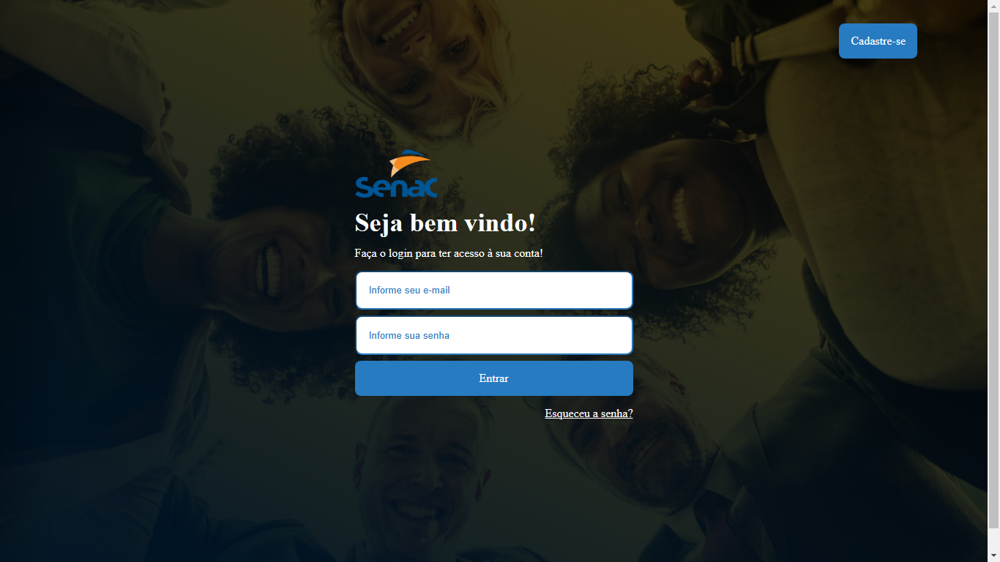

# Login-Senac
Projeto feito para projeto da "Fábrica de Software" da faculdade. Uso em projeto.

  
# Clone Linkedin

Página Web criada utilizando conceitos de html e css. Uso intenso de flexbox para criação da página de login, cadastro e de redefinição de senha.

## 🔨 Funcionalidades do projeto

Página Web criada utilizando conceitos de html e css. Uso intenso de flexbox para criação da página de login, cadastro e de redefinição de senha.

## ✔️ Técnicas e tecnologias utilizadas

- `Funcionalidade 1`: HTML. Linguagem de marcação..
- `Funcionalidade 2`: CSS. Linguagem para estilização do html.

## 📁 Acesso ao projeto

[Clique aqui para acessar](https://ericksilverio00.github.io/Login-Senac/)

## 🛠️ Abrir e rodar o projeto

Para abrir e rodar o projeto basta clicar nos ícones de navegação.
